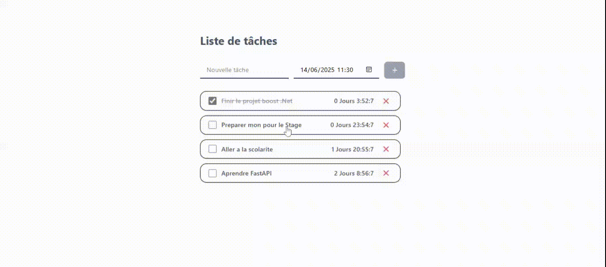

# 🎯 Projet Boost – Application Todo list (.NET + React)

Ce projet est une application web développée avec :

- 🔧 **Backend** en .NET Core (C#)
- 🎨 **Frontend** en React.js

---

## 🎬 Démonstration visuelle



> Cette animation illustre les fonctionnalités principales : navigation, affichage de données, et opérations CRUD.

---

## 🗂️ Structure du projet

```

/
├── dotnet-boost-front/        # Application frontend React
└── dotnet-boost-webApi/    # API backend .NET

````

---

## 🚀 Lancer le projet en local

### 1. Cloner le dépôt

```bash
git clone https://github.com/alyhoussen/projet-boost-dotNet.git
cd projet-boost-dotNet
````

### 2. Lancer le backend (.NET)

```bash
cd dotnet-boost-webAp
dotnet restore
dotnet ef database update   # si migrations présentes
dotnet run
```

> 📌 API par défaut disponible sur `https://localhost:5001` ou `http://localhost:5000`

### 3. Lancer le frontend (React)

```bash
cd ../dotnet-boost-front
npm install
npm start
```

> 📌 Interface accessible sur `http://localhost:5173/`

---

## ⚙️ Configuration de la base de données

Le fichier `appsettings.json` contient une chaîne de connexion générique :

```json
"ConnectionStrings": {
  "DefaultConnection": "Server=localhost;Database=tachedb;User=root;Password=;"
}
```

Vous pouvez personnaliser votre config locale.

> 🛡️ Le fichier `appsettings.Development.json` peut être utilisé pour des paramètres non partagés, et est exclu du dépôt via `.gitignore`.

---

## ✅ Fonctionnalités principales

* API RESTful avec ASP.NET Core
* Frontend dynamique avec React
* Système CRUD complet
* Connexion à une base de données MySQL

---

## 👨‍💻 Auteur

* **Nom** : Oussen Aly Joma
* **Email** : [oussenalyjoma@gmail.com](mailto:oussenalyjoma@gmail.com)
* **GitHub** : [https://github.com/alyhoussen](https://github.com/alyhoussen)

---

Merci pour la lecture ! 🙏

```
```
